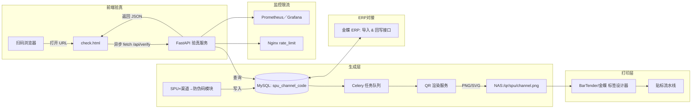

SPU 静态跳转防伪系统 项目文档
项目周期：2025-07-10 ~ 2025-08-19
团队规模：1 名全栈开发（Python）、1 名联调、ERP 协作、1名运维兼测试

## 一、目标与范围
### 1. 目标
- 为每个产品型号（SPU）×每个渠道生成唯一静态防伪码和跳转链接；
- 渲染为二维码、打印贴标；
- C 端扫码自动打开验真页，自动填码 → 用户点击“查询” → 异步请求后端 → 展示型号真伪与渠道信息。
### 2. 范围
- 粒度：SPU（非单件、非批次）；
- 二维码承载：静态 URL `https://verify.domain.com/check.html?code=<防伪码>`
- 核心职责：
  - 防伪码生成 → 入库
  - 二维码渲染 → 存 NAS
  - ERP（金蝶）对接 → 导入打印字段 & 回写
  - 标签打印 & 贴标
  - 前端验真页面 & 异步后端验真接口
  - 监控告警

## 二、核心数据模型
|表名|字段|描述|
|---|---|---|
|`spu_channel_code`|`id` (PK)|自增主键|
||`spu` (VARCHAR)|产品型号|
||`channel` (VARCHAR)|渠道名称|
||`code` (VARCHAR)|防伪码（随机串 + 可选 HMAC 签名）|
||`url` (VARCHAR)|`https://…/check.html?code=<code>`|
||`qr_path` (VARCHAR)|NAS 或 CDN 上二维码图片路径|
||`created_at` (DATETIME)|生成时间|
||`updated_at` (DATETIME)|最后更新时间|

## 三、系统架构


## 四、端到端流程
1. **防伪码生成（SPU）**
   - 输入：SPU 清单 + 渠道清单
   - 处理：
     1. 随机/算法生成 code（UUID4 + HMAC）；
     2. 拼装跳转 url；
     3. 写入 MySQL `spu_channel_code`。
2. **二维码渲染 & 存储**
   - Celery 异步消费任务；
   - 用 `qrcode[pil]` 或 `segno` 渲染；
   - 保存 PNG/SVG 到 NAS（通过 CDN 对外）。
3. **ERP（金蝶）对接**
   - 导入接口：`GET /api/spu-codes` → `{ spu, channel, code, qr_url }`；
   - 回写接口：`POST /api/spu-codes/ship` → 回传实际出货数据。
4. **标签模板 & 打印**
   - BarTender/金蝶 绑定 `qr_url`；
   - 打印机输出 → 贴标流水线扫码校验。
5. **扫码跳转 & 自动填码**
   - 扫码打开：`https://…/check.html?code=<code>`
   - 前端 JS 解析 URL 参数，自动填入输入框、启用查询按钮。
6. **前端查询 & 展示（异步）**
   ```js
   fetch(`/api/verify?code=${code}`)
     .then(resp => resp.json())
     .then(data => {
       /* 渲染结果 */
     })
   ```
   - UI 展示查询状态（加载中→结果）。
7. **后端异步验真接口**
   - FastAPI `async def /api/verify`：
     - 校验签名（HMAC）；
     - 异步查询 MySQL（使用异步驱动 + 连接池）；
     - 可先查 Redis 缓存；
     - 返回 `{ valid, spu, channel }`。
8. **监控 & 防刷**
   - Prometheus 收集 QPS、延迟、错误；
   - Grafana 看板 + 告警；
   - Nginx/IP 限流；
   - Redis 缓存降低 DB 压力；

## 五、里程碑 & 时间节点
|序号|里程碑|负责人|时间|产出物|
|---|---|---|---|---|
|1|启动&需求确认||7-10 ～ 7-12|SPU×渠道策略、防伪码规则、接口契约文档|
|2|设计&DDL/OpenAPI|Python开发|7-13 ～ 7-15|ERD、spu_channel_code 表结构、OpenAPI 文档|
|3|防伪码生成模块开发（SPU×渠道→码）|Python开发|7-16 ～ 7-18|Python 脚本：批量生成并写库，单元测试|
|4|二维码渲染服务 & NAS 存储|Python开发|7-19 ～ 7-22|Celery 任务、PNG/SVG、NAS 存放逻辑|
|5|ERP（金蝶）对接|待找金蝶方确认|7-23 ～ 7-25|/api/spu-codes 导入接口、回写接口、Mock 测试|
|6|标签模板设计 & 打印|待找金蝶方确认|7-26 ～ 7-28|BarTender/ZPL 模板、小批量试打报告|
|7|前端验真页面 (check.html)|Python开发|7-29 ～ 7-31|H5 页面 + JS 自动填码 & 异步查询逻辑|
|8|验真接口 & 安全防护|Python开发|8-1 ～ 8-3|FastAPI /api/verify（异步）、签名校验、Nginx/IP 限流、监控埋点|
|9|集成测试 & 联调||8-4 ～ 8-10|全流程联调报告、自动化测试脚本、缺陷修复|
|10|部署 & 灰度上线|运维|8-11 ～ 8-14|Docker/K8s 脚本、Nginx 配置、灰度验证报告|
|11|验收交付 & 培训|运维|8-15 ～ 8-19|验收报告、运维 SOP、培训文档|

## 六、风险 & 缓解
|风险|缓解措施|
|---|---|
|高并发验真请求|使用异步 FastAPI + uvicorn workers，接入 Redis 缓存，Nginx/IP 限流；|
|ERP 对接延迟|并行 Mock 服务，锁定契约；定期同步，预留缓冲；|
|二维码打印兼容性|提前试打多种分辨率 & 纠错级别；准备备用驱动；|
|NAS 宕机或容量不足|健康监控 & 报警；二级备份至阿里云 OSS。|

## 七、可能的其他场景
1. 离线扫码：前端可将部分静态信息（如 SPU、渠道）编码到 QR，脱离网络时展示基础真伪提示；
2. 一次性验证码：若需一次性防伪，可在后台标记已查询码，后续扫描展示“已查询”状态；
3. 批量扫码风暴：营销活动高峰期，大量扫码。需对 /api/verify 进行预热、缓存与熔断；
4. 异常网络：前端应对 fetch 超时/失败，给出“请稍后再试”友好提示；
5. 跨端体验：微信内置浏览器、小程序、App 等扫码环境兼容测试；

## 八、验收标准
1. **功能**
   - SPU → 防伪码 & URL 生成准确；
   - 二维码扫码即跳转 → 自动填码 → 异步查询展示真伪 & 渠道。
2. **性能**
   - 99% 接口响应 ≤ 500 ms；前端加载 ≤ 1 s；二维码渲染 ≥ 100 SPU×渠道／分钟。
3. **安全**
   - HTTPS 全链路；签名校验误报率 ≤ 0.1%；限流后无大规模刷验。
4. **运维**
   - 部署脚本 1 h 内完成上线；监控与告警覆盖关键指标（接口 QPS/延迟/错误、二维码生成失败率）。
